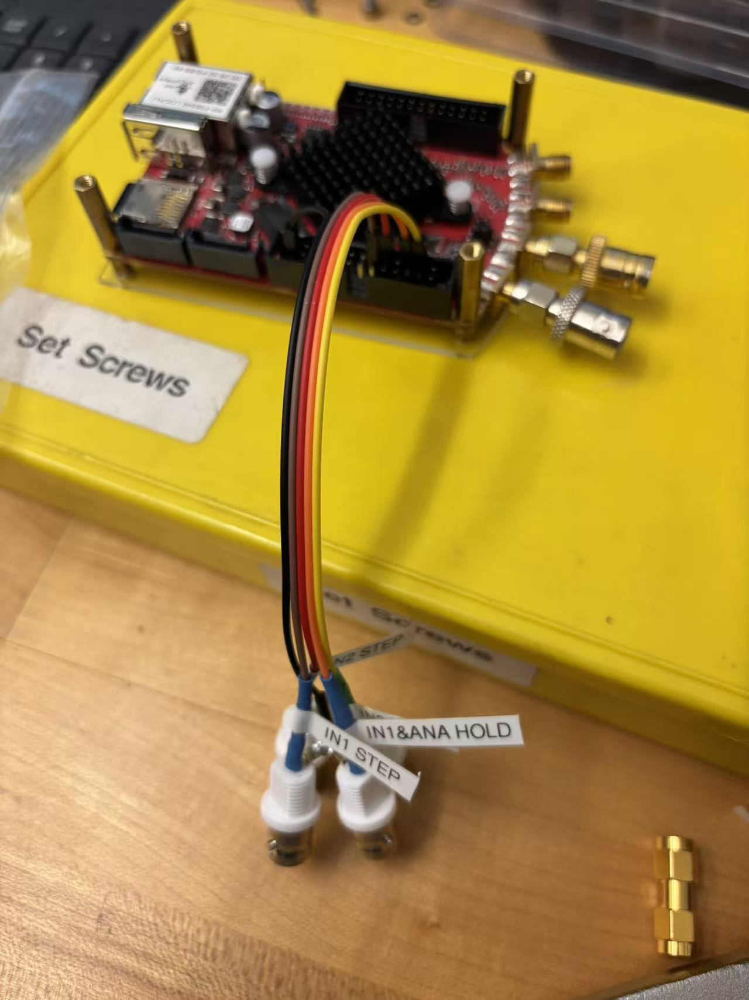

- [FPGA PID Documentation](#fpga-pid-documentation)
  - [Prerequisites](#prerequisites)
    - [Quick Start](#quick-start)
    - [Static IP Configuration](#static-ip-configuration)
    - [Input Modes: HV vs LV](#input-modes-hv-vs-lv)
    - [Noise Performance](#noise-performance)
    - [PyRPL Installation](#pyrpl-installation)
      - [Install my modified PyRPL](#install-my-modified-pyrpl)
      - [Calibration Limitations](#calibration-limitations)
  - [FPGA Code Modification using PyRPL](#fpga-code-modification-using-pyrpl)
    - [Workflow](#workflow)
    - [Implementation Tips](#implementation-tips)
  - [PID Modification: Raman Light Intensity Locking \& Digital Sequence](#pid-modification-raman-light-intensity-locking--digital-sequence)
    - [Goal](#goal)
    - [How to use PyRPL's PID module](#how-to-use-pyrpls-pid-module)
    - [Modification 1: Improve the bandwidth of PID](#modification-1-improve-the-bandwidth-of-pid)
    - [Modification 2: Hold function](#modification-2-hold-function)
    - [Modification 3: Keep the last output when hold](#modification-3-keep-the-last-output-when-hold)
    - [Modification 4: Use external trigger to change digital setpoint](#modification-4-use-external-trigger-to-change-digital-setpoint)
    - [External Trigger Configuration](#external-trigger-configuration)
    - [Labscript](#labscript)
      - [Blacs](#blacs)
      - [Fix the package conflict without downgrading in **python 3.9**](#fix-the-package-conflict-without-downgrading-in-python-39)
      - [Run 2 blacs at the same time](#run-2-blacs-at-the-same-time)
  - [Useful Sources \& Thanks](#useful-sources--thanks)


# FPGA PID Documentation 

**Author:** Wanlin Wang (wwlyn@mit.edu, wwlyn@outlook.com)

This documentation covers FPGA code modification using PyRPL for RedPitaya, eliminating the need to build FPGA code from scratch or even open Vivado. And there is a way to directly [use my modified PyRPL python package](#install-my-modified-pyrpl)

## Prerequisites

### Quick Start
- [RedPitaya Documentation](https://redpitaya.com/documentation/)

### Static IP Configuration

Set a static IP to avoid random IP changes on MIT SECURE network:
- Navigate to System → Network Manager → Static IP
- Configure your preferred IP address

### Input Modes: HV vs LV

| Mode | Range | Resolution |
|------|-------|------------|
| LV | ±1V | 2V/2^14=0.122 mV |
| HV | ±20V | 40V/2^14=2.44 mV |

**Important:** ADC normalizes inputs to ±1V. For HV mode, 0.5V input becomes 0.5/20 = 0.025 in PyRPL.

### Noise Performance
- Standard STEM 125-14: [DAC noise analysis blog](https://ln1985blog.wordpress.com/2016/02/07/red-pitaya-dac-performance/)
- Removing resistors → [0V,2V] range with better noise
- For low-noise ±1V applications, maybe we can try this product: [STEM 125-14 Low Noise Kit](https://redpitaya.com/product/stemlab-125-14-low-noise-starter-kit/). (I heard that it works but I didn't do the test)


### PyRPL Installation

[The source code of PyRPL](https://github.com/pyrpl-fpga/pyrpl)

I use the branch `max_hold_no_iir_improvement` with lock/hold function:
```bash
git clone -b max_hold_no_iir_improvement https://github.com/pyrpl-fpga/pyrpl.git
cd the_folder_name # Where setup.py exists
# conda install netifaces # I use miniconda to manage virtual environment
pip install .  # Use virtual environment recommended
pip install pyqt5
# Fix any import errors according to error messages when importing PyRPL
```
**Note:** We can resolve package conflicts by downgrading numpy, pyqtgraph etc. as needed. Use virtual environment recommended. Or we have a way to 
[fix the package conflict without downgrading.](#fix-the-package-conflict-without-downgrading-in-python-39)

#### Install my modified PyRPL

[The source code of my modified PyRPL](https://github.com/wwlyn/pyrpl_change)

If you only want to use PyRPL that I have modified, please follow this to download PyRPL package:

```bash
git clone -b max_hold_no_iir_improvement https://github.com/wwlyn/pyrpl_change.git
cd the_folder_name # Where setup.py exists
# conda install netifaces
pip install .  # Use virtual environment recommended
pip install pyqt5
# Fix any import errors according to error messages when importing PyRPL
```
I have already fixed the pyqtgraph conflict in my code, and we need to manually add some lines before importing pyrpl to fix numpy compatibility in 
[Fix the package conflict without downgrading.](#fix-the-package-conflict-without-downgrading-in-python-39)

#### Calibration Limitations

PyRPL cannot read RedPitaya's calibration data, causing ADC/DAC offsets. For PID applications, this is usually acceptable since the goal is Error=0.

- Digital setpoint: Manually offset calibration needed for precise physical values, see [the method in the notebook](ManualCalibration.ipynb).
- Analog setpoint: No calibration needed because the difference between 2 inputs matters, and finally it will go to 0.
- Some fancy feedbacks which need precise value of raw data: May require fixing this issue from hardware!

**References:** [Forum-RedPitaya](https://forum.redpitaya.com/viewtopic.php?t=25268) | [Issue #347](https://github.com/pyrpl-fpga/pyrpl/issues/347) | [Issue #398](https://github.com/pyrpl-fpga/pyrpl/issues/398)

## FPGA Code Modification using PyRPL

### Workflow

1. **Setup Vivado 2015.4**
   - [Download Vivado 2015.4](https://www.xilinx.com/support/download/index.html/content/xilinx/en/downloadNav/vivado-design-tools/archive.html)
   - Configure license in Vivado License Manager
   - Update Vivado path in `BranchName/pyrpl/fpga/Makefile`

2. **Edit Verilog Code**
   - Modify files in `BranchName\fpga\rtl\`:
     - `red_pitaya_pid_block.v` - PID logic
     - `red_pitaya_dsp.v` - External trigger connections

3. **Compile Bitstream**
   ```bash
   cd BranchName/fpga # Enter where the Makefile exists
   make all  # Use Git Bash on Windows
   ```
   - Success: generates `red_pitaya.bin`
   - Errors: check `out/fpga.log` for grammar & clock errors

4. **Deploy & Test**
   - Replace `site-packages/.../fpga/red_pitaya.bin` in your Python environment
   - Update software code (e.g., `pid.py`)
   - Restart kernel (if you use jupyter notebook) - PyRPL auto-loads new bitstream!

5. **(If needed) Debug Logic Error**
   - Launch Vivado → open `fpga\project`
   - Update `pyrpl.srcs\sources_1\import\rtl` with files from `fpga\rtl`
   - Run simulation to check register values

### Implementation Tips

**Basic Register Classes:** PyRPL provides pre-built register classes for common data types, like float, bool etc.:
```python
min_voltage = FloatRegister(0x124, bits=14, norm=2**13, doc="minimum output [volts]")
use_setpoint_sequence = BoolRegister(0x130, doc="Enable sequence mode")
```

**⚠️ Critical:** Register addresses must be **4-byte aligned** (`0x130`, `0x134`, `0x138`...). This cannot be checked during compilation but just makes the RP not function well!

**Using AI recommended**: We can easily understand FPGA code using **built-in** AI models like Copilot in VSCode. Simply ask it to explain the code structure, data flow, registers and their bitwidths... It's very convenient!

## PID Modification: Raman Light Intensity Locking & Digital Sequence

More functions to see in [the official tutorial of PyRPL](https://github.com/pyrpl-fpga/pyrpl/blob/main/docs/example-notebooks/tutorial.ipynb).
        
**My Repository Links:**
- [FPGA modifications](https://github.com/wwlyn/pyrpl_change)
- [Labscript integration](https://github.com/wwlyn/red_pitaya_pyrpl_pid)


### Goal

First, we want to improve the PID function as much as possible.

Then, we want to run the sequence. To be specific, we want to run the sequence as below:

<figure>
  
  <figcaption>When the light is off, we don't want the lockbox to work otherwise if there is DC signal, it will saturate. And we also want to change the setpoint during the hold and when unhold, the lockbox will lock to another setpoint.</figcaption>
</figure>

### How to use PyRPL's PID module

RedPitaya implements standard PID control: 
$$\text{Output}(t) = K_p \cdot e(t) + K_i \cdot \int_0^t e(\tau) d\tau + K_d \cdot \frac{de(t)}{dt}$$
where $e(t) = \text{input} - \text{setpoint}$.

**Two Basic Operation Modes:**

| Mode | Configuration |
|------|---------------|
| **Digital Setpoint** | Single PID module |
| **Analog Setpoint** | Dummy module + functional PID (differential mode) |


**Digital Setpoint Example:**
```python
from pyrpl import Pyrpl
p = Pyrpl(hostname=HOSTNAME)
pid = p.rp.pid0

pid.input = "in1"
pid.output_direct = "out1"
pid.setpoint = 0.2
pid.ival = 0
pid.p, pid.i = 0, 0
pid.min_voltage, pid.max_voltage = -0.99, 0.99
pid.pause_gains = "pi"
pid.paused = False
```

**Analog Setpoint Example (Differential Mode):**
```python
# Dummy PID for analog setpoint
pid_dummy = p.rp.pid0
pid_dummy.input = "in2"  # Reference signal
pid_dummy.paused = True

# Main PID in differential mode
pid = p.rp.pid1
pid.input = "in1"  # Control signal
pid.output_direct = "out2"
pid.differential_mode_enabled = True  # Error = pid1.input - pid0.input
pid.ival = 0
pid.p, pid.i = 0, 0 
pid.min_voltage, pid.max_voltage = -0.99, 0.99
pid.pause_gains = "pi"
pid.paused = False
```

### Modification 1: Improve the bandwidth of PID

**Problem:** PyRPL limits $K_i$ to 38kHz (unity gain frequency when $K_p, K_d=0$), restricting PID bandwidth despite FPGA's 8ns clock capability.

**Root Cause:** Limited GAINBITS (24 bits) for $K_i$ register.

**Solution:** Increase GAINBITS by 1 bit → doubles $K_i$ upper limit → higher bandwidth in `red_pitaya_pid_block.v`. Don't forget to change the value of GAINBITS in `pid.py`.


**Test Results:**

With the simplest PID loop: just connecting the input to the output. Blue is setpoint, and yellow is input(output). 

| Configuration | $K_p$ | Set $K_i$ | Rise Time |
|---------------|-------|-------|-----------|
| **Before** | 0 | 3.8×10⁴(to limit) | ~30kHz |
| **After** | 0 | 4×10⁵ | ~800kHz |

<figure>
  
  <figcaption><strong>Before:</strong> Simple loop test with Ki=3.8e4, limited to ~30kHz bandwidth</figcaption>
</figure>

<figure>
  
  <figcaption><strong>After:</strong> Same setup with Ki=4e5, achieving ~800kHz bandwidth</figcaption>
</figure>

When we set a value higher than limitation, we can see on the terminal:
```
WARNING:pyrpl.modules:Requested gain for pid0.i is outside the bounds allowed by the hardware. Desired gain of 1.0e+12 is capped to 2.5e+06. 
```

### Modification 2: Hold function 

**Problem:** Integral range [-4V,+4V] exceeds output limits [-1V,+1V], causing delayed response in hold/unhold sequences.

**Issue:** When changing setpoint during hold, integral accumulates beyond output range within delay time, requiring long integration time to return to useful range when unhold.

**Impact:** External trigger sequences malfunction due to excessive integration delays.

| Test Condition | Response Time | Description |
|----------------|---------------|-------------|
| **Open Loop with Proportional only** | ~180ns | Normal delay time |
| **Open Loop with integral** | ~18μs | Saturation recovery time (-4V → -1V) |


<figure>
  
  <figcaption><strong>With Proportional only:</strong> Blue is input and yellow is output. The output will just be Kp * input. Pure proportional control shows ~180ns delay time</figcaption>
</figure>

<figure>
  
  <figcaption><strong>With integral:</strong> Yellow is setponit and blue is output. The integral value will saturate between 2 limits when the (input - setpoint) changes between positive value and negative value. The saturation recovery (-4V → -1V) causes 18μs delay.</figcaption>
</figure>

### Modification 3: Keep the last output when hold

**Problem:** PyRPL's hold function outputs only the integral term, setting proportional term to zero instead of maintaining the complete last output.

**Impact:** Works for small $K_p$ and stable locks (error ≈ 0), but causes dramatic output jumps when:
- Using high $K_p$ (bandwidth-limited systems)
- Error signals have large fluctuations

**Solution:** Modified FPGA code to preserve total PID output during hold.

### Modification 4: Use external trigger to change digital setpoint

**Why digital over analog setpoint sequences?**

| Issue | Analog Setpoint | Digital Setpoint |
|-------|-----------------|------------------|
| **Noise** | ~20mV AC noise (no impedance matching) | Fixed digital values |
| **Stability** | Oscillates with certain P&I values | No oscillation issues at the same P&I, can push bandwidth further |
| **ADC/DAC Noise** | Uses both (2× noise) | Uses DAC only (1× noise) |

**Implementation:** Pre-loaded digital setpoint sequence with external rise detection.

**Performance:**

Tested in the simplest PID loop which just connects input and output of RP.

<figure>
  
  <figcaption><strong>Digital sequence operation:</strong> Purple = external trigger, Yellow = PID input(=output)</figcaption>
</figure>


| Parameter | Value | Speed Limitation |
|-----------|-------|------------------|
| **Rise detection** | ~36ns | Hardware: ADC & FPGA |
| **Setpoint change**| ~1MHz | Loop bandwidth & setpoint step size |

<figure>
  
  <figcaption><strong>Trigger detection:</strong> RedPitaya detects trigger edges in ~36ns</figcaption>
</figure>

<figure>
  
  <figcaption><strong>Hardware-limited response:</strong> Rise time constrained only by loop bandwidth</figcaption>
</figure>

### External Trigger Configuration

<figure>
  
  <figcaption><strong>RedPitaya Pin Assignment:</strong> DIO0_P/1_P/2_P control hold function for PID0/1/2. DIO3_P/4_P/5_P control setpoint sequence stepping.</figcaption>
</figure>


<figure>
  
  <figcaption><strong>External Trigger Connection:</strong> Standard trigger signal wiring diagram.</figcaption>
</figure>

**My Labscript Configuration:**

| Pin | Function | Module |
|-----|----------|---------|
| DIO0_P | Hold Control | `digital_setpoint_in2` |
| DIO1_P | Hold Control | `digital_setpoint_in1` & `analog_setpoint` |
| DIO3_P | Sequence Stepping | `digital_setpoint_in2` |
| DIO4_P | Sequence Stepping | `digital_setpoint_in1` |


<figure>
  
  <figcaption><strong>Ground Sharing Structure:</strong> All triggers share one ground pin through BNC to avoid multiple ground connections.</figcaption>
</figure>

### Labscript

#### Blacs

<figure>
  
  <figcaption>Blacs GUI Interface</figcaption>
</figure>

**Function Overview:**

- **Write to config**: Save current PID configuration. After restart, select the saved config file and click `Refresh and Read` + `Enable PID` to restore.

- **Pause PID**: Pause all PID modules simultaneously.

- **Output to Zero and Pause**: Set all outputs to zero and pause PIDs. Output range is 0-2V with resistors removed.

- **Setpoint source**: Choose operation mode (analog/digital setpoint). One RedPitaya can run 2 digital setpoints simultaneously.

- **PID Parameters**: Edit parameters and press Enter to apply. `Ival` is integral value with offset due to removed resistors.

- **Enable & Disable PID**: Independently enable/disable specific PID modules based on `pause_gains` setting. If the `pause_gains` is `off`, you cannot stop a PID; if it's `i`, you can stop integral.


- **Refresh and Read**: Update latest values. **Always click this first when selecting old config files.**

- **Error Plot**: Display error and integral values of selected PID module.

- **Setpoint Sequence**: Available only in digital setpoint mode. Click `Use setpoint` to enable, input setpoint array. External trigger or manual stepping cycles through setpoints. When reaching the last setpoint and `Refresh and Read`, the `Last Setpoint` will be green `Triggered`.

**Package Conflict Solutions:**

PyRPL installation causes package conflicts. Two approaches:

| Method | Pros | Cons | Recommended For |
|--------|------|------|-----------------|
| [**Fix conflicts directly**](#fix-the-package-conflict-without-downgrading-in-python-39) | Keep new-version packages, preserves base environment, use RunManager | Requires manual fixes in package source code | Want to use all the devices in one env & directly use RP to run sequence not only external trigger |
| **Run dual Blacs** | Use old-version packages in virtual env, reserves base environment | Cannot directly use RP to run sequence | Complex conflicts in packages that cannot be manually fixed |


#### Fix the package conflict without downgrading in **python 3.9**

This fix is done in python 3.9, and it may not suit other python version (python 3.11 can't, I haven't try some other.)

In NumPy 2.x, some old warning classes and type aliases were removed.
This snippet restores the missing names so that older code (like PyRPL) can run without errors.
It does not change any behavior—just adds aliases for compatibility.

```
import numpy as np
if not hasattr(np, 'VisibleDeprecationWarning'):
    np.VisibleDeprecationWarning = UserWarning
if not hasattr(np, 'ComplexWarning'):
    np.ComplexWarning = UserWarning
if not hasattr(np, "complex"):
    np.complex = complex
```

Fix pyqtgraph version:

The `pg.GraphicsWindow` class was removed in PyQtGraph version 0.13.x and later. This causes compatibility issues when running PyRPL with newer versions of PyQtGraph.

We can change `pg.GraphicsWindow` to `pg.GraphicsLayoutWidget` to fix it. This method only applies when we don't use the GUI of PyRPL.


#### Run 2 blacs at the same time

We can use environment variables to isolate Blacs configurations per terminal. Blacs config path: `C:\Users\Username\labscript-suite\labconfig\XXX.ini`

That is because `...\Lib\site-packages\labscript_profile\__init__.py`:
```python
#...
try:
    LABSCRIPT_SUITE_PROFILE = Path("~" + getuser()).expanduser() / 'labscript-suite'
except Exception:
    LABSCRIPT_SUITE_PROFILE = None
```
So `$env:USERPROFILE` defines the directory.

**Implementation:**
1. **In one powershell, go to the virtual environment, and set custom profile path:** `$env:USERPROFILE = "C:\MyLib"`
2. **Create separate config:** `C:\MyLib\labscript-suite\labconfig\XXX.ini`
3. **Configure connection table path** in new config file
4. **Run the blacs**: 

**Example config structure:**
```ini
[DEFAULT]
apparatus_name = MyFirstApparatus
shared_drive = D:
experiment_shot_storage = %(shared_drive)s\Research\Cs\Experiments\%(apparatus_name)s
userlib= %(labscript_suite)s\userlib
pythonlib = %(userlib)s\pythonlib
labscriptlib = %(userlib)s\labscriptlib\%(apparatus_name)s
analysislib = %(userlib)s\analysislib\%(apparatus_name)s
app_saved_configs = %(labscript_suite)s\app_saved_configs\%(apparatus_name)s
user_devices = user_devices
```
defines where to find the `connection_table.py`. After that, run `python -m blacs` in the virtual environment, and then labscript will run `C:\MyLib\labscript-suite\labconfig\XXX.ini`. We can set the new connection_table directory in this file and then run 2 Blacs at the same time.

## Useful Sources & Thanks

**References:**
- [Official RedPitaya Documentation](https://redpitaya.com/documentation/)
- [PyRPL Source Code](https://github.com/pyrpl-fpga/pyrpl)

**About This Documentation:**

RedPitaya has great potential for advanced feedback systems like second-order integrators through custom FPGA logic. This documentation shares my experience using PyRPL to modify RedPitaya's FPGA without building from scratch. I've focused on aspects necessary for my goals—there's much more to explore. Please feel free to correct any errors.

**Acknowledgments:**

Special thanks to Vivian & Ziv (MIT), Chenyuan Li (Princeton) for sharing RedPitaya resources, and to David, Vivian & Ziv (MIT), Wenjun Zhang & Shuyao Mei (Tsinghua), and Chenyuan Li (Princeton) for productive discussions!
